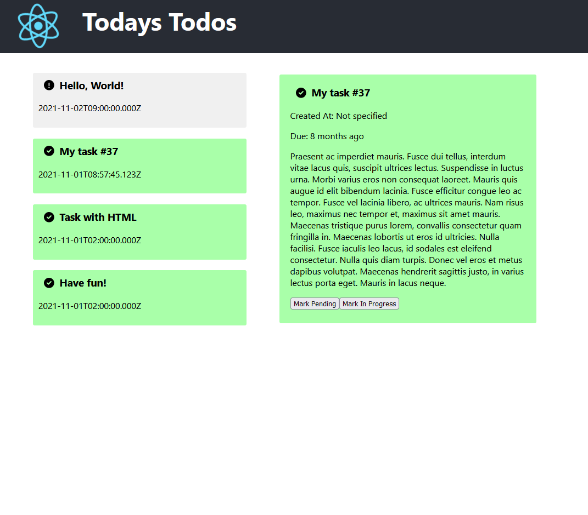

# React Todo

## Prerequisites
- NodeJS
- Docker (for dockerfiles)

## Install
```npm install```

## Start
```npm start```

## Docker

```docker build --rm -t react-todos```

```docker run -p 3000:3000 react-todos```

## Screenshots

